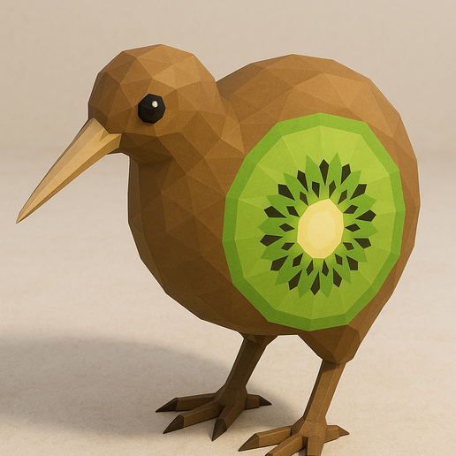
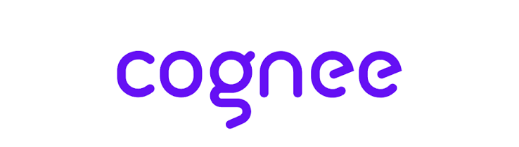
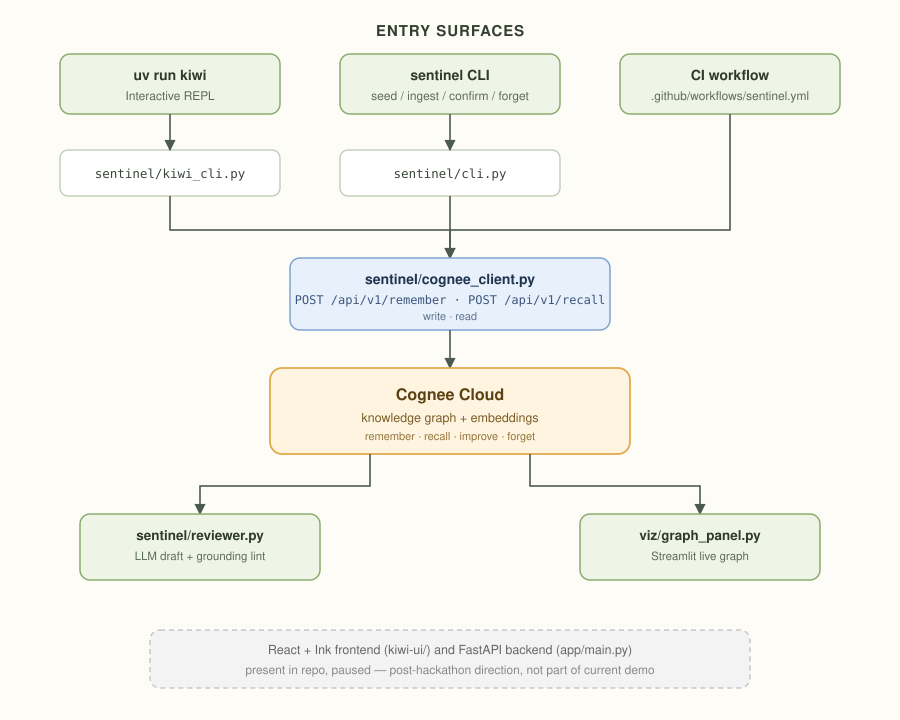

<!-- <p align="center">
  
  
</p> -->

<p align="center">
  
  
</p>


<h1 align="center">Kiwi</h1>
<p align="center"><i>A CI memory layer, built on Cognee Cloud.</i></p>

---

## What it does

Kiwi ingests JUnit test failures, stores them in a Cognee knowledge graph, and recalls prior incidents the next time the same class of failure shows up — turning a flat "test failed" into "we've seen this before, here's what fixed it." Reviews are grounded: any claim about history is checked against what was actually recalled before it's shown.

Concretely: when a PR's CI run fails, Kiwi reads the failure (the diff, the stack trace, the file it happened in) and writes it into Cognee's memory as a linked record — test, error, file, fix, all connected. The next time a failure looks similar, Kiwi pulls that memory back out automatically and surfaces it right where it's needed — in the CLI, the PR review, or the graph panel — instead of an engineer re-investigating something the team already solved once.

---

## Running it

```bash
cp .env.example .env          # fill in COGNEE_BASE_URL, COGNEE_API_KEY, COGNEE_TENANT_ID
uv sync
uv run sentinel seed          # load historical failures into Cognee (~20s)
uv run kiwi                   # start the REPL
```

Or visualize the live memory graph:
```bash
uv run streamlit run viz/graph_panel.py
```

Full setup details: [HOW_TO_RUN.md](HOW_TO_RUN.md)

---

<!-- ## Architecture -->

<!-- ```
┌──────────────────────────────────────────────────────┐
│                  Entry surfaces                      │
│  uv run kiwi (REPL)  │  sentinel CLI  │  CI workflow │
└──────────────┬────────────────┬────────────────┬─────┘
               │                │                │
               ▼                ▼                ▼
     sentinel/kiwi_cli.py  sentinel/cli.py  .github/workflows/
               │                │
               └────────┬───────┘
                        ▼
           sentinel/cognee_client.py
           POST /api/v1/remember  (write)
           POST /api/v1/recall    (read)
                        │
                        ▼
                  Cognee Cloud
              (knowledge graph + embeddings)
                        │
               ┌────────┴────────┐
               ▼                 ▼
    sentinel/reviewer.py    viz/graph_panel.py
    LLM draft + grounding   Streamlit live graph
``` -->

## Architecture



> React + Ink frontend (`kiwi-ui/`) and FastAPI backend (`app/main.py`) exist in the repo but are paused — post-hackathon direction, not part of the current demo.

<p align="center"> Built by <i><b><a href="http://app.notion.com/p/DeadEnd-Engineers-3139801ed37b80e1ac97e8c1ccabe0d0">Team 12'oCaffeine</a></b></i> </p>